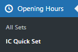
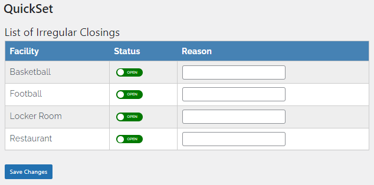
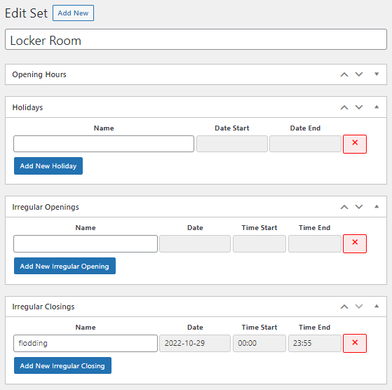
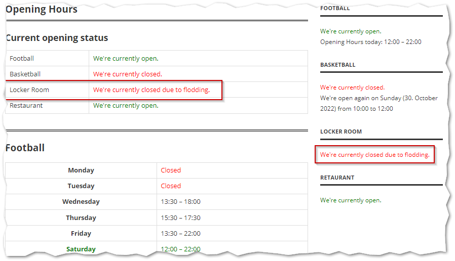
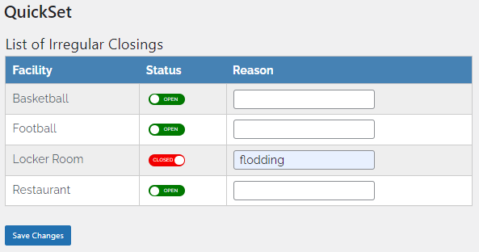
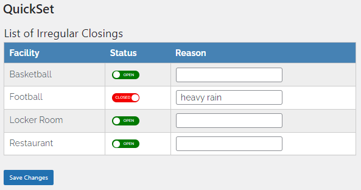

# WordPress Opening Hours Extension

As it says,  WordPress Opening Hours Extension is an extension to the WordPress Opening Hours plugin initially developed by [jannizde](https://github.com/janizde/WP-Opening-Hours).

To use this extension, the version available at ([GitHUB](https://github.com/Jannico23/WP-Opening-Hours)), supporting irregular closings needs to be installed first.

## What does it provide

A simplified user interface to manage the opening status of your facilities by creating or removing irregular closing entries for the **current day** (i.e., current day 00:00 to 23:55).

<u>New menu item, IC Quick Set</u>

<u>Example of the simplifies UI:</u>

## How does it work

It's not perfect, but it works!

To recap - With the new version of the Opening Hours plugin ([GitHUB](https://github.com/Jannico23/WP-Opening-Hours)) supporting irregular closings you can override any configured schedule by creating an irregular closing for a particular day (00:00 to 23:55). An entry matching the current day will override the regular schedule and set the "Is Open Status" widget or shortcode to closed.

<u>Dialogue in the Opening Hours plugin to configure a schedule</u>

<u>And here, the result shown on the webpage:</u>

With this extension (Opening Hours Extension - OHX), you can now change the opening status by using the sliders and entering a reason for the closing.

**When opening the dialogue:**

The logic of the dialogue parses all facilities (e.g., Football, Basketball, etc.) for an irregular closing matching the current date/time. If an entry was found,  the dialogue will set the slider for that particular facility to closed and uses the name of the irregular closing to populate the reason. If no entry was found, the slider will be set to open.

<u>Dialogue reflecting the current opening status according to the current date/time and the irregular closing entries:</u>

You can now set the preferred ad-hoc opening status (e.g., due to weather, or other conditions of a facility), enter a reason and save the changes.

**When saving the changes:**

The plugin will evaluate the transition of the sliders and update the irregular closing entries by using the update_post_meta() function.

| Transition               | How the data is processed                                    |
| ------------------------ | ------------------------------------------------------------ |
| none                     | No changes                                                   |
| none, but reason updated | The reason (name) of the irregular closing will be updated   |
| open >> closed           | A new irregular closing entry will be added (todays date, 00:00 to 23:55) |
| closed >> open           | The irregular entry used previously to populate the dialogue will be removed |

## Limitations

We expect, to have only **one irregular closing per facility and day** and it has to span over the whole day (i.e., 00:00 to 23:55). If a facility has several irregular closings for a particular day - especially overlapping entries -  (e.g., 00:00 to 09:00 and 00:00 to 23:55), the logic will pick the first entry found to populate the QuickSet dialogue. This entry will then be updated/deleted, depending on the transition. However, the second, overlapping entry will remain unchanged and cause unexpected results on the webpage.

If you are using this plugin exclusively to manage the irregular closings, such situations will not occur. 

## Roles and Capabilities

To access the IC Quick Set dialogue you need to add the **ohx-quickset** capability to all roles allowed to use it. To do so, you can use a the [Roles & Capabilities](https://wordpress.org/plugins/leira-roles/) plugin.

Alternatively you can remove or comment the following lines in the file "class-ohx-admin.php":

`// check if the current user is allowed to call this function`

`if ( !current_user_can( 'ohx-quickset' ) )  {`

​    `wp_die( __( 'You do not have sufficient permissions to access this page.' ) );`

 `}`

